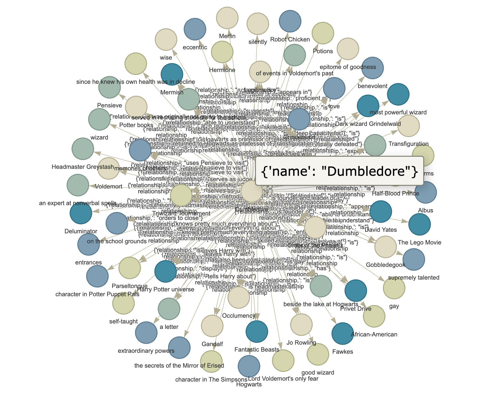

# Knowledge Graphs and RAG

Knowledge graph implementation using Nebula Graph + Retrieval augmented generation.
An example of a knowledge graph is `Dumbledore.html` where we can see the relationships between various entities with `depth=1`, mainly focusing on the character <a href="https://en.wikipedia.org/wiki/Albus_Dumbledore">Albus Dumbledore<a> from Harry Potter.

## Talking docs

Utilized a FinetunedTransformer model (Llama2) to implement multi-document summarization, enhancing it with MMR, TextRank, and clustering techniques for redundancy reduction, keyword extraction, and semantic data gathering respectively—implemented RAG (retrieval augmented generation) to give the model extra knowledge of documents for interactive conversations.
